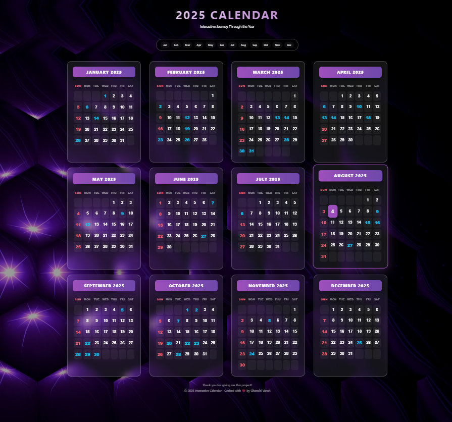

# 📅 2025 Interactive Calendar

A clean, high-end, responsive web-based calendar project featuring modern design principles. This project showcases a full-year calendar for 2025 with glassmorphism effects, interactive elements, and a dynamic video background.

## 🔗 Live Preview
Experience the full interactivity here: **[Live Demo](https://vansh-ghanchi.github.io/Interactive-2025-Calendar-/)**

## 📸 Ghanchi Vansh's Project Preview


## 🛠️ Tech Stack
This project is built using pure, high-performance web technologies:
- **HTML5**: Semantic structure for accessibility and SEO.
- **CSS3 (Modern)**: 
  - **Glassmorphism**: Advanced UI with `backdrop-filter`.
  - **CSS Grid & Flexbox**: Dynamic 4-column layout (Desktop) that scales to 1-column (Mobile).
  - **Keyframe Animations**: Custom smooth transitions and pulsing interactive elements.
- **Vanilla JavaScript**: 
  - **Auto-Today Logic**: Real-time detection and highlighting of the current date.
  - **Smooth Navigation Engine**: Custom scroll behavior for the month-jump menu.
  - **UI Interaction**: Hidden-to-visible "Back to Top" button logic.

## ✨ Key Features
- **💎 Glassmorphism Cards**: Premium frosted-glass aesthetic for every month.
- **📱 Ultra-Responsive**: Perfectly balanced 4x3 grid on desktop, 2-column on tablets, and 1-column on mobile.
- **📍 Sticky Navigation Pill**: A floating menu that stays at the top for quick access to any month.
- **🌙 High-Contrast Sunday Highlighting**: Improved visibility for weekends using Coral Red.
- **⚡ Interactive Media Links**: Specific dates pulse with light and link to unique images or videos.
- **🔝 One-Click Return**: Floating "Back to Top" button with a smooth glide animation.

## 🚀 How to Run Locally
Since this is a modern front-end project, it runs directly in any browser with zero installation.

1. **Download/Clone** the project:
   ```bash
   git clone https://github.com/Vansh-Ghanchi/Interactive-2025-Calendar-.git
   ```
2. **Open** the folder and double-click `index.html`.

## 🧠 What I Mastered
- **Responsive Grid Architecture**: Designing a 4-column system that manages 12 complex items across all screen sizes.
- **Premium UI/UX Patterns**: Implementing glassmorphism and sticky headers while avoiding element overlap (using `scroll-margin-top`).
- **Dynamic DOM Manipulation**: Using JavaScript to find and style the current date based on live system time.
- **Modern Git Workflow**: Pushing high-quality UI updates and managing asset caching (Busting cache with `v2` filenames).

---
*Crafted with ❤️ by Ghanchi Vansh*
